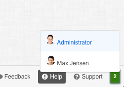

# Who's Looking for SugarCRM 7.5

This addon puts a new item in the menu that will show you how many other people are looking at the current page you are on.



# Work in Progress

This is a work in progress but you are welome to test it out on development instances.

# Requires

- NodeJS to run the server, can be run on [Heroku], but is currently setup with no configuration.
- SugarCRM 7.5 or newer

# Running Server
You Need NodeJS 0.10.x or newer.

## Running Locally
```shell
node index.js
```

## Running on Heroku
Assuming that you have a [Heroku] account setup, and the [Heroku DevTools] already installed

```shell
heroku create <application name here>
git push heroku master
```

# Packaging the Client
If you are running the server locally you can just use the zip file that is included, but if you are using Heroku you will need to recompile the package using [grunt].

Start by installing the [NodeJS] modules, this assumes that you have [NodeJS] already installed

```shell
npm install
```

Now Install Grunt Globally

```shell
npm install -g grunt-cli
```

After the install has completed, you can run the follow command to generate the package. By passing `--server=` to the `package` command, you can have the package have the correct server, instead of localhost.

```shell
grunt package --server=<your server here>
```

# Installing Into SugarCRM
All you need to do is use the module loader and load up the zip file and install it, after it has been installed just refresh your browser and if it can connect you'll see a count, in the footer of the application.

# ToDo
- Better Detection when it can't connect to the server
- Add JS Tests
- Add Config Panel for configuring the ioServer
- Better Documentation

[NodeJS]: http://nodejs.org/
[Grunt]: http://http://gruntjs.com/
[Heroku]: https://heroku.com/
[Heroku DevTools]: https://devcenter.heroku.com/articles/heroku-command
